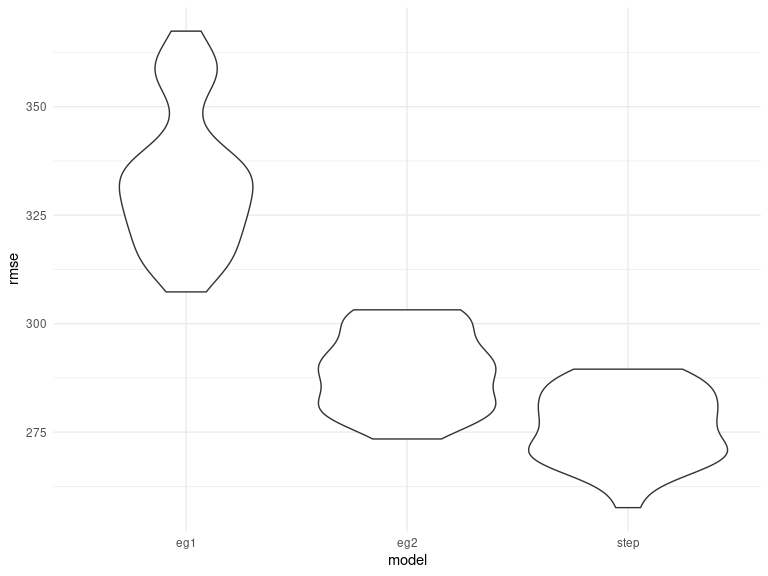
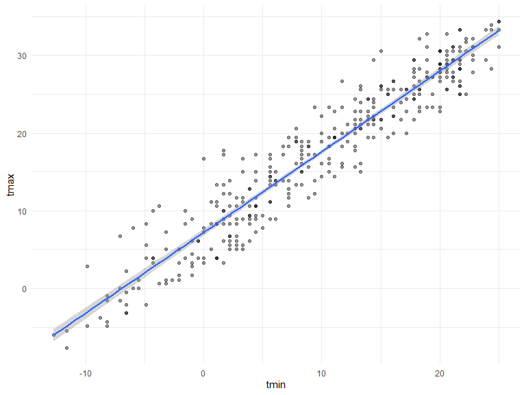
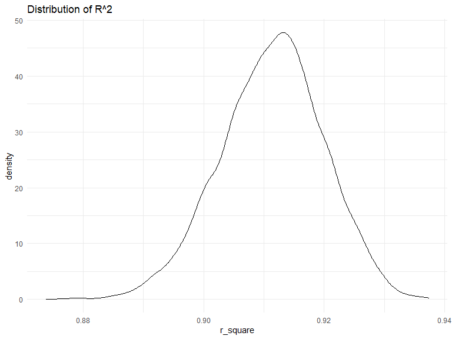
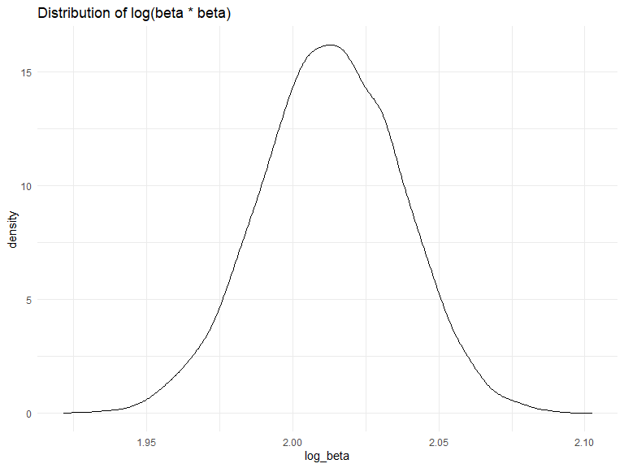

Homework 6
================
Jeffrey Liang
11/23/2020

# Problem 1

Read in the data.

``` r
homicide_df = 
  read_csv("data/data-homicides-master/homicide-data.csv") %>% 
  mutate(
    city_state = str_c(city, state, sep = "_"),
    resolved = case_when(
      disposition == "Closed without arrest" ~ "unsolved",
      disposition == "Open/No arrest"        ~ "unsolved",
      disposition == "Closed by arrest"      ~ "solved"
    ),
    resolved = forcats::fct_relevel(resolved,"unsolved"),
    victim_age = as.numeric(victim_age),
    victim_sex = as.factor(victim_sex)
  ) %>% 
  select(-city,-state,-victim_last,-victim_first,-lon,-lat) %>% 
  filter(!str_detect(city_state,"Tulsa|Dallas|Phoenix|Kansas"),
         victim_race %in% c("White","Black"),
         victim_sex %in% c("Male","Female")) %>% 
  nest(c(-city_state))
```

Do linear regression

``` r
homicide_df =
  homicide_df %>%
  mutate(log = map(
    .x = data,
    ~ glm(
      resolved ~ victim_age + victim_sex + victim_race,
      data = .x,
      family = binomial()
    )
  ),
  result  = map(log, broom::tidy)) %>% 
  select(-data) %>% 
  unnest(result) %>% 
  mutate(ci = map2(.x = log,
                               .y = term,
                               ~confint(.x,.y))) %>% 
  select(city_state,term,estimate,ci) %>% 
  filter(term == "victim_raceWhite")

homicide_df %>% 
  head() %>% 
  knitr::kable()
```

| city\_state     | term              | estimate | ci             |
| :-------------- | :---------------- | -------: | :------------- |
| Albuquerque\_NM | victim\_raceWhite |    0.412 | \-0.419, 1.224 |
| Atlanta\_GA     | victim\_raceWhite |    0.269 | \-0.278, 0.843 |
| Baltimore\_MD   | victim\_raceWhite |    0.842 | 0.501, 1.187   |
| Baton Rouge\_LA | victim\_raceWhite |    0.447 | \-0.302, 1.238 |
| Birmingham\_AL  | victim\_raceWhite |  \-0.068 | \-0.592, 0.462 |
| Boston\_MA      | victim\_raceWhite |    2.365 | 1.53, 3.37     |

# Problem 2

Import data

``` r
birthweight =
  read_csv(here::here("data/birthweight.csv")) %>%
  janitor::clean_names() %>%
  mutate(
    across(
      c("frace", "mrace"),
      ~ case_when(
        .x == 1 ~ "White",
        .x == 2 ~ "Black",
        .x == 3 ~ "Asian",
        .x == 4 ~ "Puero Rican",
        .x == 8 ~ "Other",
        .x == 9 ~ " Unknown"
      )
    ),
    across(where(is.character), as.factor),
    malform = case_when(malform == 0 ~ "absent",
                        malform == 1 ~ "present"),
    malform = as.factor(malform),
    babysex = case_when(babysex == 1 ~ "male",
                        babysex == 2 ~ "female") %>% as.factor()
  )


birthweight %>% skimr::skim_without_charts()
```

|                                                  |            |
| :----------------------------------------------- | :--------- |
| Name                                             | Piped data |
| Number of rows                                   | 4342       |
| Number of columns                                | 20         |
| \_\_\_\_\_\_\_\_\_\_\_\_\_\_\_\_\_\_\_\_\_\_\_   |            |
| Column type frequency:                           |            |
| factor                                           | 4          |
| numeric                                          | 16         |
| \_\_\_\_\_\_\_\_\_\_\_\_\_\_\_\_\_\_\_\_\_\_\_\_ |            |
| Group variables                                  | None       |

Data summary

**Variable type: factor**

| skim\_variable | n\_missing | complete\_rate | ordered | n\_unique | top\_counts                             |
| :------------- | ---------: | -------------: | :------ | --------: | :-------------------------------------- |
| babysex        |          0 |              1 | FALSE   |         2 | mal: 2230, fem: 2112                    |
| frace          |          0 |              1 | FALSE   |         5 | Whi: 2123, Bla: 1911, Pue: 248, Asi: 46 |
| malform        |          0 |              1 | FALSE   |         2 | abs: 4327, pre: 15                      |
| mrace          |          0 |              1 | FALSE   |         4 | Whi: 2147, Bla: 1909, Pue: 243, Asi: 43 |

**Variable type: numeric**

| skim\_variable | n\_missing | complete\_rate |    mean |     sd |     p0 |    p25 |    p50 |    p75 |   p100 |
| :------------- | ---------: | -------------: | ------: | -----: | -----: | -----: | -----: | -----: | -----: |
| bhead          |          0 |              1 |   33.65 |   1.62 |   21.0 |   33.0 |   34.0 |   35.0 |   41.0 |
| blength        |          0 |              1 |   49.75 |   2.72 |   20.0 |   48.0 |   50.0 |   51.0 |   63.0 |
| bwt            |          0 |              1 | 3114.40 | 512.15 |  595.0 | 2807.0 | 3132.5 | 3459.0 | 4791.0 |
| delwt          |          0 |              1 |  145.57 |  22.21 |   86.0 |  131.0 |  143.0 |  157.0 |  334.0 |
| fincome        |          0 |              1 |   44.11 |  25.98 |    0.0 |   25.0 |   35.0 |   65.0 |   96.0 |
| gaweeks        |          0 |              1 |   39.43 |   3.15 |   17.7 |   38.3 |   39.9 |   41.1 |   51.3 |
| menarche       |          0 |              1 |   12.51 |   1.48 |    0.0 |   12.0 |   12.0 |   13.0 |   19.0 |
| mheight        |          0 |              1 |   63.49 |   2.66 |   48.0 |   62.0 |   63.0 |   65.0 |   77.0 |
| momage         |          0 |              1 |   20.30 |   3.88 |   12.0 |   18.0 |   20.0 |   22.0 |   44.0 |
| parity         |          0 |              1 |    0.00 |   0.10 |    0.0 |    0.0 |    0.0 |    0.0 |    6.0 |
| pnumlbw        |          0 |              1 |    0.00 |   0.00 |    0.0 |    0.0 |    0.0 |    0.0 |    0.0 |
| pnumsga        |          0 |              1 |    0.00 |   0.00 |    0.0 |    0.0 |    0.0 |    0.0 |    0.0 |
| ppbmi          |          0 |              1 |   21.57 |   3.18 |   13.1 |   19.5 |   21.0 |   22.9 |   46.1 |
| ppwt           |          0 |              1 |  123.49 |  20.16 |   70.0 |  110.0 |  120.0 |  134.0 |  287.0 |
| smoken         |          0 |              1 |    4.15 |   7.41 |    0.0 |    0.0 |    0.0 |    5.0 |   60.0 |
| wtgain         |          0 |              1 |   22.08 |  10.94 | \-46.0 |   15.0 |   22.0 |   28.0 |   89.0 |

We don’t know what we interest in, so I just assume to predict
birthweight, so let first make our data in to cross validation
partitions.

``` r
md_step =
  glm(bwt ~ ., data = birthweight) %>% 
  step(direction = "both",
                    scope = list(lower = . ~ 1,
                                 upper = . ~ . ^ 2),
                    trace = 0)

summary(md_step)
```

    ## 
    ## Call:
    ## glm(formula = bwt ~ babysex + bhead + blength + delwt + fincome + 
    ##     gaweeks + malform + mheight + momage + mrace + parity + ppbmi + 
    ##     smoken + bhead:mrace + bhead:mheight + fincome:mrace + blength:smoken + 
    ##     gaweeks:momage + delwt:gaweeks + bhead:smoken + gaweeks:malform + 
    ##     babysex:momage + babysex:bhead + babysex:gaweeks + delwt:ppbmi + 
    ##     blength:ppbmi + blength:delwt + blength:mheight + blength:gaweeks + 
    ##     bhead:ppbmi + fincome:smoken + babysex:delwt + babysex:malform + 
    ##     gaweeks:mrace + gaweeks:ppbmi, data = birthweight)
    ## 
    ## Deviance Residuals: 
    ##     Min       1Q   Median       3Q      Max  
    ## -1077.4   -178.3     -1.7    169.5   1955.4  
    ## 
    ## Coefficients:
    ##                             Estimate Std. Error t value Pr(>|t|)    
    ## (Intercept)                -4.57e+03   3.21e+03   -1.42  0.15481    
    ## babysexmale                -1.57e+02   1.80e+02   -0.87  0.38337    
    ## bhead                      -3.02e+02   9.47e+01   -3.19  0.00144 ** 
    ## blength                     3.10e+02   6.19e+01    5.01  5.7e-07 ***
    ## delwt                      -1.98e+01   7.28e+00   -2.72  0.00646 ** 
    ## fincome                     6.27e-02   1.91e+00    0.03  0.97384    
    ## gaweeks                     9.04e+01   3.91e+01    2.31  0.02088 *  
    ## malformpresent             -1.71e+03   5.26e+02   -3.26  0.00112 ** 
    ## mheight                     1.65e+01   4.54e+01    0.36  0.71653    
    ## momage                     -2.74e+01   1.51e+01   -1.82  0.06897 .  
    ## mraceBlack                 -2.63e+03   1.24e+03   -2.12  0.03440 *  
    ## mracePuero Rican           -2.14e+03   1.29e+03   -1.66  0.09676 .  
    ## mraceWhite                 -3.33e+03   1.25e+03   -2.67  0.00755 ** 
    ## parity                      1.22e+02   4.17e+01    2.93  0.00343 ** 
    ## ppbmi                       1.54e+02   4.76e+01    3.24  0.00120 ** 
    ## smoken                     -1.67e+01   1.32e+01   -1.27  0.20374    
    ## bhead:mraceBlack            1.18e+02   4.59e+01    2.57  0.01021 *  
    ## bhead:mracePuero Rican      9.99e+01   4.71e+01    2.12  0.03403 *  
    ## bhead:mraceWhite            1.32e+02   4.60e+01    2.86  0.00422 ** 
    ## bhead:mheight               4.18e+00   1.25e+00    3.34  0.00085 ***
    ## fincome:mraceBlack         -5.20e-01   1.93e+00   -0.27  0.78797    
    ## fincome:mracePuero Rican   -1.15e+00   2.25e+00   -0.51  0.60985    
    ## fincome:mraceWhite          9.27e-01   1.93e+00    0.48  0.63028    
    ## blength:smoken              1.04e+00   2.78e-01    3.74  0.00018 ***
    ## gaweeks:momage              7.55e-01   3.78e-01    2.00  0.04595 *  
    ## delwt:gaweeks              -2.84e-01   9.27e-02   -3.07  0.00217 ** 
    ## bhead:smoken               -1.12e+00   4.85e-01   -2.31  0.02112 *  
    ## gaweeks:malformpresent      3.99e+01   1.27e+01    3.13  0.00175 ** 
    ## babysexmale:momage         -4.17e+00   2.16e+00   -1.93  0.05348 .  
    ## babysexmale:bhead           1.55e+01   5.70e+00    2.71  0.00672 ** 
    ## babysexmale:gaweeks        -5.42e+00   2.88e+00   -1.88  0.05971 .  
    ## delwt:ppbmi                -8.76e-02   3.28e-02   -2.67  0.00760 ** 
    ## blength:ppbmi              -5.19e+00   9.84e-01   -5.28  1.4e-07 ***
    ## blength:delwt               7.54e-01   1.41e-01    5.35  9.2e-08 ***
    ## blength:mheight            -3.25e+00   9.23e-01   -3.52  0.00043 ***
    ## blength:gaweeks            -7.68e-01   3.84e-01   -2.00  0.04585 *  
    ## bhead:ppbmi                 1.91e+00   1.08e+00    1.76  0.07815 .  
    ## fincome:smoken             -3.75e-02   2.16e-02   -1.74  0.08211 .  
    ## babysexmale:delwt          -6.43e-01   3.88e-01   -1.66  0.09754 .  
    ## babysexmale:malformpresent  2.93e+02   1.49e+02    1.96  0.05021 .  
    ## gaweeks:mraceBlack         -3.59e+01   3.29e+01   -1.09  0.27597    
    ## gaweeks:mracePuero Rican   -3.12e+01   3.33e+01   -0.94  0.34859    
    ## gaweeks:mraceWhite         -2.79e+01   3.29e+01   -0.85  0.39552    
    ## gaweeks:ppbmi               9.91e-01   6.65e-01    1.49  0.13638    
    ## ---
    ## Signif. codes:  0 '***' 0.001 '**' 0.01 '*' 0.05 '.' 0.1 ' ' 1
    ## 
    ## (Dispersion parameter for gaussian family taken to be 72007)
    ## 
    ##     Null deviance: 1138652193  on 4341  degrees of freedom
    ## Residual deviance:  309486252  on 4298  degrees of freedom
    ## AIC: 60931
    ## 
    ## Number of Fisher Scoring iterations: 2

``` r
md_step =
  terms(md_step) %>% 
  attr("term.labels") %>% 
  str_c(.,collapse = "+") %>% 
  str_c("bwt~",.) %>% 
  as.formula()

set.seed(1)
birthweight_cv =
  modelr::crossv_mc(birthweight, 100, id = "id") %>%
  mutate(
    md_step =
      map(.x = train,  ~ do.call("glm", list(bwt ~ ., data = .x))),
    md_step = map(.x = md_step,
                  ~ step(
                    .x,
                    direction = "both",
                    scope = list(lower = . ~ 1,
                                 upper = . ~ . ^ 2),
                    trace = 0
                  )),
    #is the stepwise model all alike across all cv train?
    md_eg1 =
      map(.x = train,  ~ lm(bwt ~ blength + gaweeks, data = .x)),
    md_eg2 =
      map(.x = train,  ~ lm(bwt ~ blength * bhead * babysex, data = .x)),
    #Fitted the model, now how to verify the prediction?
    rmse_step =
      map2_dbl(.x = md_step,
               .y = test,
               ~ modelr::rmse(.x, .y)),
    rmse_eg1 =
      map2_dbl(.x = md_eg1,
               .y = test,
               ~ modelr::rmse(.x, .y)),
    rmse_eg2 =
      map2_dbl(.x = md_eg2,
               .y = test,
               ~ modelr::rmse(.x, .y))
  )

birthweight_cv %>%
  mutate(across(starts_with("rmse"), as.numeric)) %>%
  pivot_longer(
    starts_with("rmse"),
    values_to = "rmse",
    names_to =  "model",
    names_prefix = "rmse_"
  ) %>%
  ggplot(aes(x = model, y = rmse)) +
  geom_violin()
```

<!-- -->  My
model is generate via both-way stepwise variable selection. The second
example model has lower rmse compared to the first model, and my model
has lower rmse comapred to both example model.

\# Problem 3

Load data

``` r
weather_df = 
  rnoaa::meteo_pull_monitors(
    c("USW00094728"),
    var = c("PRCP", "TMIN", "TMAX"), 
    date_min = "2017-01-01",
    date_max = "2017-12-31") %>%
  mutate(
    name = recode(id, USW00094728 = "CentralPark_NY"),
    tmin = tmin / 10,
    tmax = tmax / 10) %>%
  select(name, id, everything())
```

Look at the distribution

``` r
weather_df %>% 
  ggplot(aes(x = tmin, y = tmax))+
  geom_point(alpha = 0.4)+
  geom_smooth(method = "lm")
```

<!-- -->

Produce bootstrap sample

``` r
set.seed(1)
weather_bt =
  modelr::bootstrap(weather_df,
                    n = 1000,
                    id = "id") %>%
  mutate(
    strap = map(strap, as_tibble),
    md =
      map(.x = strap,
          ~ lm(tmax ~ tmin, data = .x)),
    r_square =
      map2_dbl(.x = md,
               .y = strap,
               ~ modelr::rsquare(.x, .y)),
    md = map(md, broom::tidy)
  ) %>%
  unnest(md) %>%
  select(id, term, estimate, std_error = std.error, r_square)

weather_bt %>% head() %>% knitr::kable()
```

| id   | term        | estimate | std\_error | r\_square |
| :--- | :---------- | -------: | ---------: | --------: |
| 0001 | (Intercept) |     7.45 |      0.223 |     0.907 |
| 0001 | tmin        |     1.03 |      0.017 |     0.907 |
| 0002 | (Intercept) |     7.36 |      0.243 |     0.896 |
| 0002 | tmin        |     1.03 |      0.019 |     0.896 |
| 0003 | (Intercept) |     7.48 |      0.215 |     0.918 |
| 0003 | tmin        |     1.04 |      0.016 |     0.918 |

Examine Bootstrap result

``` r
weather_bt %>% 
  distinct(id,r_square) %>% 
  ggplot(aes(x = r_square))+
  geom_density()
```

<!-- -->

``` r
weather_bt %>% 
  select(id,term,estimate) %>% 
  pivot_wider(
    names_from = term,
    values_from = estimate
  ) %>% 
  janitor::clean_names() %>% 
  mutate(
    log_beta =
      log(tmin*intercept)
  ) %>% 
  ggplot(aes(x = log_beta))+
  geom_density()
```

<!-- -->

 The r^2 follows approximately normal distribution. By central limit
theorem the sampling distribution of R^2 will follow normal distribution
with mean equal to true R^2.

 The log(beta0hat and the beta1hat) follows an approximately normal
distribution, follows the central limit theorem.
